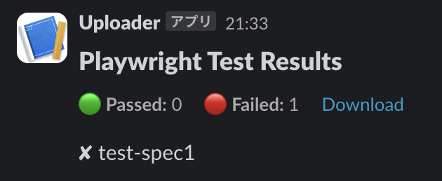

# Playwright Test Reporter to Slack
This GitHub Action parses Playwright test results from a JSON file and sends a formatted report to a Slack channel using an Incoming Webhook. It is designed to help teams monitor test outcomes directly in Slack, providing quick insights into test failures and successes.



## Features
- **Test Result Summarization:** Summarizes the test results showing the number of passed and failed tests.
- **Failed Test Details:** Lists only the failed tests
- **Optional Artifact Link:** Includes a downloadable link to test artifacts if provided.

## Inputs
- `results-json-path`: Required Path to the JSON file containing Playwright test results.
- `artifact-url`: Optional URL to the test artifact for downloading directly from Slack.

## Environment Variables
`SLACK_WEBHOOK_URL`: Required The Incoming Webhook URL provided by Slack.

## Usage
Below is an example of how to set up this action in your .github/workflows directory:

```yaml
name: Playwright Test
on: [push]

jobs:
  report_to_slack:
    runs-on: ubuntu-latest
    steps:
      - name: Checkout code
        uses: actions/checkout@v2
      - name: Run Playwright tests
        run: PLAYWRIGHT_JSON_OUTPUT_NAME=report/report.json npx playwright test --reporter=json
      - name: Upload report to GitHub Actions Artifacts
        id: report-upload-step
        uses: actions/upload-artifact@v4
        if: ${{ !cancelled() }}
        with:
          name: report
          path: report/
          retention-days: 30
      - name: Report to slack
        uses: kenfdev/playwright-report-slack-action
        with:
          results-json-path: 'report.json'
          artifact-url: ${{ steps.report-upload-step.outputs.artifact-url }}
        env:
          SLACK_WEBHOOK_URL: ${{ secrets.SLACK_WEBHOOK_URL }}
```

## Setup Slack
1. Create an Incoming Webhook:
  - Navigate to your Slack App configurations and create an incoming webhook.
    Select the Slack channel where messages will be posted and save the webhook URL.
2. Add the Webhook URL to GitHub Secrets:
  - Go to your repository settings on GitHub.
  - Click on Secrets and add SLACK_WEBHOOK_URL with the URL you obtained from Slack.

## Local Development
To test and modify this action locally:

- Ensure you have jq installed on your machine.
- Clone the repository and make changes to the main.sh script.
- Run tests to ensure the script processes the JSON file correctly.

## License
Distributed under the MIT License. See LICENSE for more information.